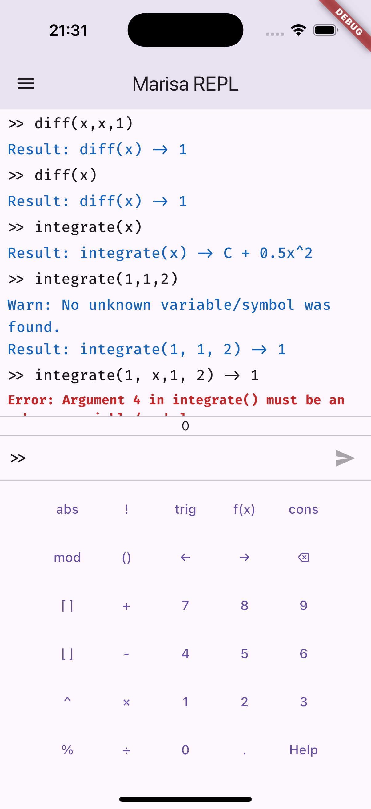
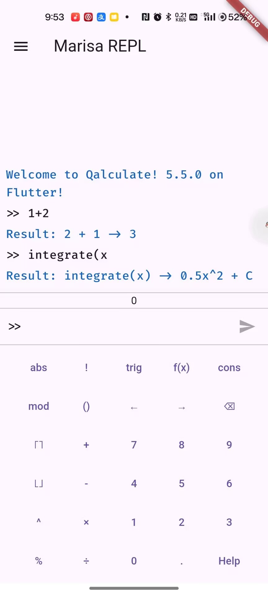

# cmcalc

[中文版简介](README_CN.md)

CMCalc flagship version: Qalculate! frontend in Android and iOS

This program is the beginning a series of calculator software called CMCalc, a attempt to bring 
FOSS Computer Algebra System to the mobile platform (iOS and Android). It is now working in 
progress, and I am doing my best to cover all the functionality available to the end users.

The CMCalc project's goal includes:
 - A Flutter frontend for CAS in the mobile platform
 - Wrapper library for the CAS libraries

Planning product:
 - [Qalculate!](http://qalculate.github.io/)
 - [eigenmath](https://georgeweigt.github.io/)

Hopes an adorable and cute girl with [pretty blue eyes](https://www.youtube.com/watch?v=r1of21efNtk) 
helps me, where is she...

## Planning Feature

TIER 1 Functions:

 - [ ] An REPL to use libqalculate's function directly with user-friendly input.
 - [ ] Calendar conversion.
 - [x] BMI Calculation.
 - [ ] Symbolic input window for limit, integration and differentiation.
 - [ ] The Nine Chapter.

TIER 2 Function:
 - [ ] History storage, lots of work on native code.
 - [ ] Variables and functions storage, lots of work on native code.
 - [ ] Currency conversion, related to libcurl.
 - [ ] Plotting, related to gnuplot.

## License

GPLv2 or later, since libqalculate is licensed under it.

Files in /lib can be licensed under LGPLv2 or later.

## How to compile?

For Android, I bunded a libqalculate aar file in `android/app/lib/qalculate-5.5.0.aar` folder, so just simply compile it. The aar file is compiled using [this script](https://github.com/BenderBlog/libqalculate-android).

For iOS, unfortunately you need to compile the libqalculate xcframework first. You should set your terminal folder to `ios/libqalc` first, and execute the `compile_libqalculate_ios.sh` script. **Do not execute the script at anywhere else!** And then, you can go for the compile, if there's no magic smoke...
